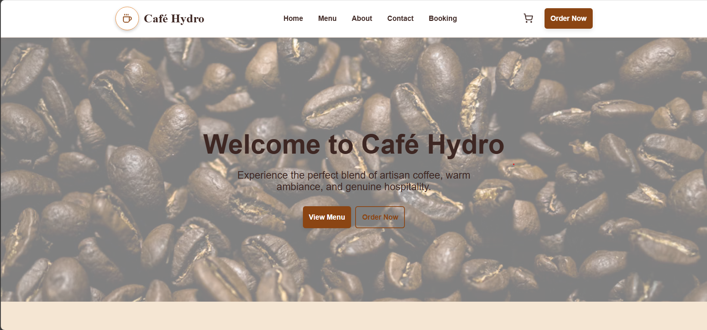
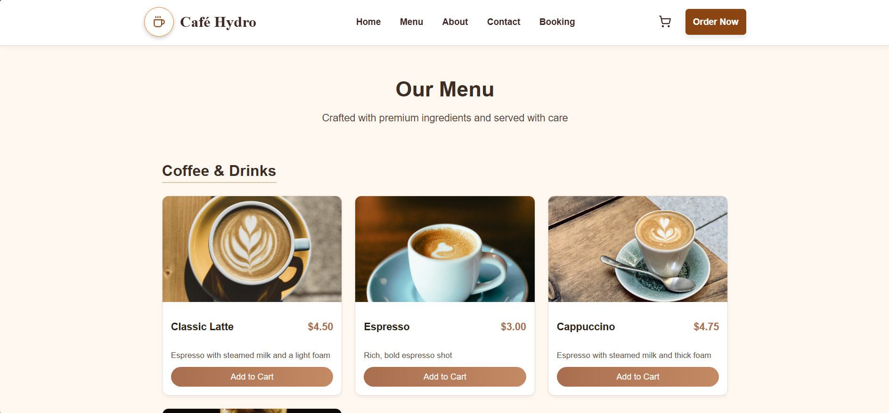
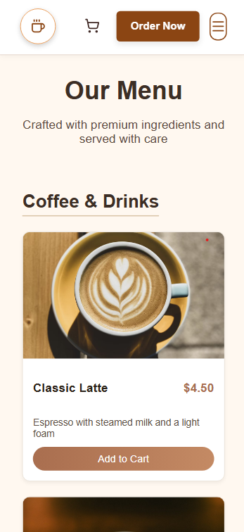
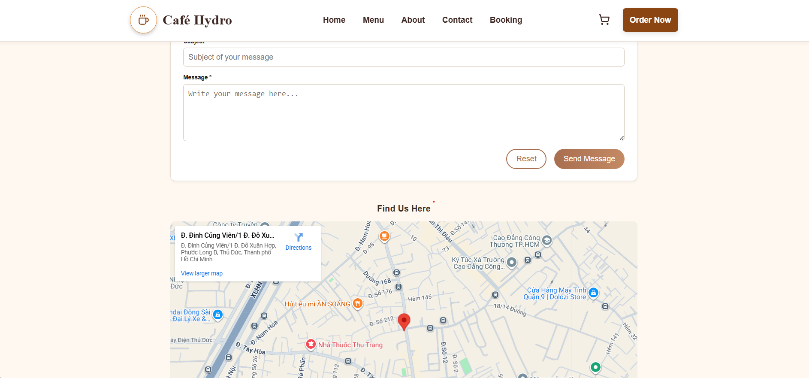

# Café Hydro — Coffee Shop Website

A modern and responsive front-end website for a fictional café, **Café Hydro**.  
Built with **pure HTML, CSS, and JavaScript**, featuring dynamic menus, cart management via `localStorage`, and Lucide icons for a sleek UI.

---

## Project Structure

```
Coffee-Hydro/
├── index.html         → Home page
├── menu.html          → Menu list of drinks and pastries
├── about.html         → Our story and values
├── contact.html       → Contact form + Google Maps location
├── booking.html       → Table reservation form
├── cart.html          → Shopping cart with item modifiers
├── order.html         → Order summary and pickup form
├── assets/
│   ├── css/           → Theme, layout, responsive, and page styles
│   ├── js/            → Menu, Cart, Order, and Navigation scripts
│   ├── images/        → Café imagery and icons
│   └── ...
└── README.md
```

## Main Features

### Cart Management (using `localStorage`)

- Items persist across pages using `localStorage`.
- Allows modifying:
  - Size (Small / Medium / Large)
  - Quantity
  - Sweetness (range input)
  - Add-ons (checkboxes: caramel, vanilla, whipped cream)
- Real-time price updates and tax calculation.

### Order Summary

- Displays all cart items with full details (size, quantity, add-ons, etc.).
- Collects user info (name, email, phone, pickup time/date, and notes).

### Booking Form

- Simple reservation form for tables (date, time, number of guests).
- Validation for required fields and input types.

### Contact Page

- Includes a functional form for inquiries.
- Integrated Google Maps iframe pinned to:  
  `Số 1 Đỗ Xuân Hợp, Phước Long A, Q9, Tp.HCM`.

---

## How to Run

### Local Preview

1. Clone or download the repository:
   ```bash
   git clone https://github.com/HoangHuy1405/Coffee-Hydro.git
   cd Coffee-Hydro
   ```
2. right-click index.html → "Open with Live Server"

### Deploy

View the demo at this url: https://hoanghuy1405.github.io/Coffee-Hydro/

---

## Demo

Here’s a quick look at **Café Hydro** in action:

### Homepage



### Menu



### Menu (mobile version)



### Contact



View more at this link: https://hoanghuy1405.github.io/Coffee-Hydro/
